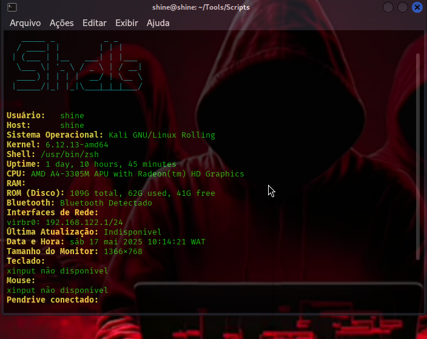

# Systinf

> **O sistema de inteligência cibernética que faz o N. parecer um brinquedo.**  
> Terminal. Inteligente. Mortalmente informativo.


 

## Descrição

**Systinf** é uma ferramenta shell multi-plataforma (Linux, Termux e macOS) feita para exibir informações detalhadas sobre seu sistema, hardware, rede e segurança. Ele combina o estilo visual de ferramentas como `neofetch`, mas com profundidade de análise como `lshw`, `inxi` e `nmap`, tudo num só script modular.

---

## Características

- **Modular com Flags**: escolha o que mostrar
- **Suporte Total**: Linux, Termux, macOS
- **Informações Avançadas**:
  - Hardware (RAM, CPU, GPU, disco, temperatura)
  - Rede (IP público, DNS, interfaces)
  - Segurança (usuários sudoers, último login, firewall)
  - USB e periféricos conectados
  - Teclado, mouse e monitor
  - Atualizações do sistema
  - IP público e DNS ativo
- **Banner visual** em ASCII com cores
- **Modo stealth** opcional (futuro)

---

## Instalação

```bash
git clone https://github.com/HKshine/Systinf.git 
cd Systinf
chmod +x hard.sh
````
Execute 
```
./hard.sh
```

